# DigiSutra Backend Architecture and HLD

## 1. Purpose and scope

This document is the high-level design (HLD) for the backend currently implemented in `apps/api/src`. It covers:

- request routing, authentication, authorization, and ownership checks;
- user and seller onboarding;
- products and private digital-asset storage/delivery;
- marketplace order creation and the financial ledger;
- payment order creation, checkout confirmation, webhook reconciliation, and refunds;
- seller balance, payout, retry, and reconciliation flows;
- invoices, purchase history, support/operations, and dashboard reads;
- PostgreSQL access, transaction boundaries, consistency rules, and failure handling.

The implementation is a modular Flask application, not a distributed microservice system. The diagrams therefore show logical modules and external integrations, not independently deployed services.

## 2. System context

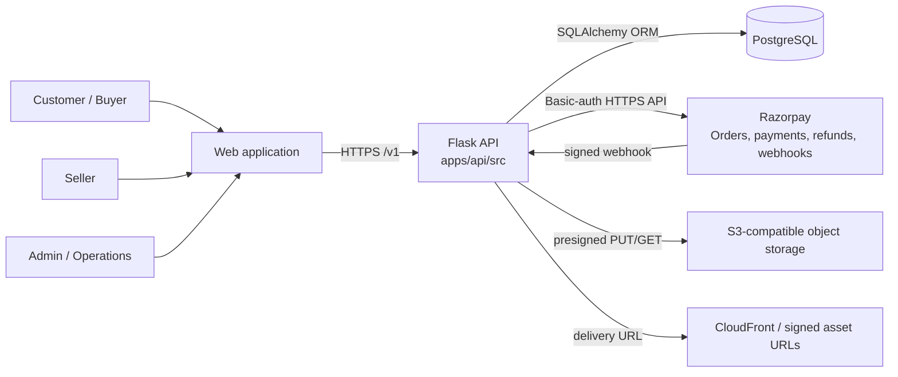

### 2.1 Runtime components

| Component | Responsibility | Implementation location |
|---|---|---|
| Flask application | App boot, CORS, blueprint registration, health endpoint | `apps/api/src/app.py` |
| Versioned router | `/v1` route registration | `apps/api/src/v1/routers/` |
| Controllers | HTTP methods, request/response mapping, access checks | `apps/api/src/controllers/` |
| Serializers/services | Validation, orchestration, state changes, provider calls | `apps/api/src/serializers/`, `services/` |
| SQLAlchemy models | Relational persistence and relationships | `apps/api/src/models/` |
| Auth utility | EdDSA JWT creation/verification and role decorator | `apps/api/src/utils/auth.py` |
| PostgreSQL | System of record for identity, catalog, orders, money state, access, and support | `POSTGRES_DB_URI` |
| Razorpay gateway | Provider order/refund calls and HMAC verification | `apps/api/src/services/razorpay_gateway.py` |
| S3 gateway | Presigned upload/download and object metadata | `apps/api/src/services/s3_asset_gateway.py` |

### 2.2 Request pipeline

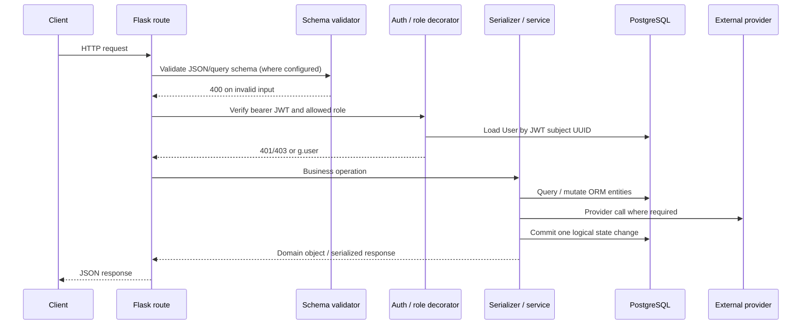

Validation is implemented with Cerberus. Most write operations are wrapped by `session_rollback(db)`, which rolls back the SQLAlchemy session for non-integrity exceptions before returning the error to the controller.

## 3. Authentication and authorization

### 3.1 User registration

Endpoint: `POST /v1/users/`

```mermaid
sequenceDiagram
    participant C as Client
    participant API as SignUp controller
    participant U as UserSerializer
    participant DB as PostgreSQL

    C->>API: firstname, lastname, email, password
    API->>API: Cerberus UserCreate validation
    API->>U: Normalize names/email; force customer role
    U->>U: Hash password with Werkzeug
    U->>DB: Check case-insensitive username
    U->>DB: INSERT user(uuid, username, password hash, customer)
    DB-->>U: Commit
    U-->>C: 201 {uuid}
```

Registration always overrides the requested role to `customer` in the controller. Passwords are stored as hashes; the raw password is not persisted.

### 3.2 Login and access-token verification

Endpoint: `POST /v1/users/login/`

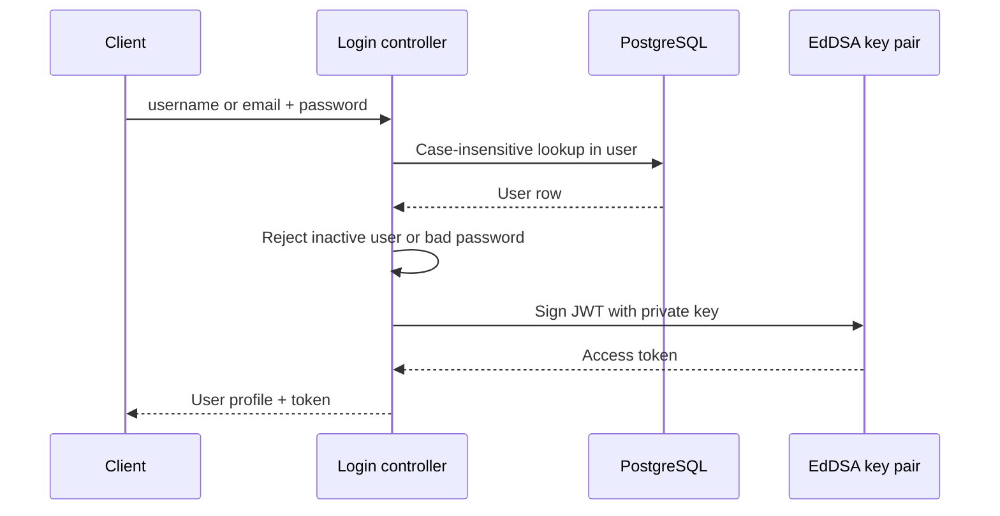

The access JWT contains `sub=user.uuid`, `username`, `role`, `iat`, and `exp`. The default lifetime is 24 hours. The token is signed with EdDSA using `AUTH_EDDSA_PRIVATE_KEY_PEM`; verification uses `AUTH_EDDSA_PUBLIC_KEY_PEM`.

For an authenticated request, `require_auth`:

1. reads `Authorization: Bearer <token>`;
2. verifies the signature and required claims (`sub`, `iat`, `exp`);
3. loads the current user from PostgreSQL by UUID;
4. rejects a missing, expired, invalid, or inactive user with `401`;
5. compares `user.user_type` to the endpoint role set;
6. stores `g.user` and `g.auth_payload` for the controller.

There is no refresh-token or server-side token-revocation store in the current implementation. Deactivating a user prevents future requests because the user is reloaded on every authenticated request.

### 3.3 Role authorization and resource ownership

Role checks are coarse-grained endpoint checks. Resource checks are performed in controllers/serializers after loading the resource.

| Role | Typical permissions |
|---|---|
| `customer` | Buy products, view own orders, request refunds, apply to become a seller |
| `seller` | Manage own products/assets, view own sales/payouts, request payouts when operational |
| `admin` | User list, seller review, suspension/readiness, all order/payout/ops views and mutations |

Important ownership rules:

- a payment order and checkout confirmation require the authenticated user to be the order buyer;
- order detail is visible only to its buyer, seller, or an admin;
- only the buyer or an admin can create a refund request;
- a seller can only create/manage assets belonging to that seller’s product;
- asset delivery requires the authenticated buyer to own the order, the asset to belong to the purchased product, payment to be `paid`, and access to be `granted`;
- seller payout requests are scoped to the authenticated seller by the controller; admin requests can select a seller;
- seller operations also check seller profile suspension and payout hold where applicable.

## 4. Seller onboarding and operational controls

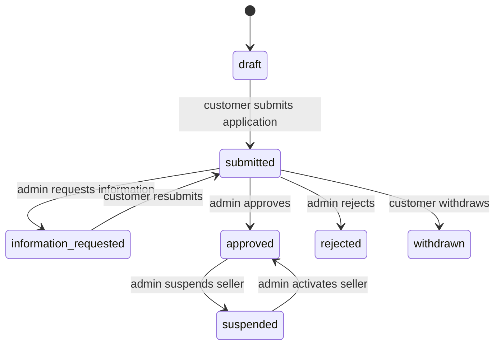

Flow:

1. An authenticated customer creates/updates a `SellerApplication` draft.
2. The customer submits it; the serializer validates the current owner and changes status to `submitted`.
3. An admin lists or opens applications and can request information, reject, or approve.
4. Approval creates/updates `SellerProfile` and promotes the user to the seller role in the same database transaction.
5. Admin can suspend/activate the seller and set payout readiness. Suspension or payout hold blocks relevant operational/payout actions.

Primary tables: `user`, `seller_applications`, and `seller_profiles`. Reviewer and applicant are both foreign keys to `user`.

## 5. Product and digital-asset flow

### 5.1 Product/catalog flow

Products are owned by a `User` through `product.owner_id`. Product creation/update/deactivation is guarded by seller/admin authorization and ownership validation. The catalog stores price and currency as `Numeric(10,2)`, with public/active flags and optional image metadata.

### 5.2 Upload flow

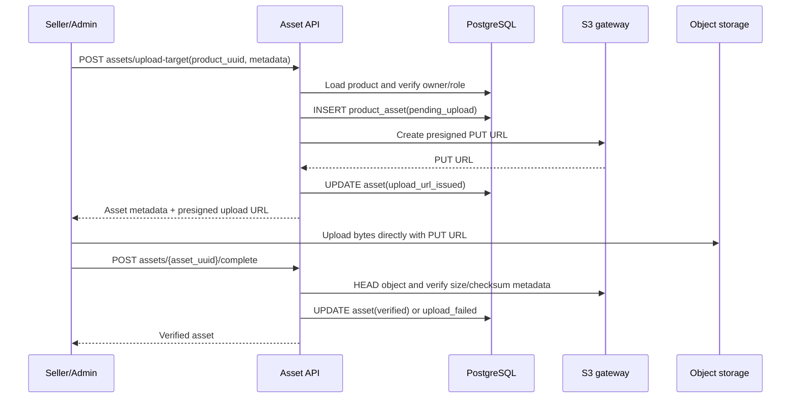

The API does not proxy file bytes. `product_asset` is the metadata/state record; S3 is the content store. Asset states include `pending_upload`, `upload_url_issued`, `verified`, and `upload_failed`.

### 5.3 Download authorization and one-time delivery token

```mermaid
sequenceDiagram
    participant B as Buyer
    participant API as Asset API
    participant DB as PostgreSQL
    participant CDN as S3/CloudFront

    B->>API: POST assets/{asset_uuid}/deliver {order_uuid}
    API->>DB: Load asset, order, product_access
    API->>API: Verify buyer, paid order, matching product, granted access, expiry/limit
    API->>CDN: Create short-lived presigned GET URL
    API->>API: Sign EdDSA delivery JWT (jti, user, asset, order, URL, exp)
    API-->>B: download_url + delivery token
    B->>API: POST assets/{asset_uuid}/downloads + X-Asset-Delivery-Token
    API->>API: Verify token, user, asset, expiry, one-time-use claim
    API->>DB: INSERT delivery_token_use; increment download_count; INSERT download event
    API-->>B: Download event accepted
    B->>CDN: GET signed URL
```

The delivery token defaults to 15 minutes. `DeliveryTokenUse.token_jti` prevents reuse. `ProductAccess` is granted after payment and revoked after a processed refund.

## 6. Marketplace order and ledger model

The “ledger” is currently a set of relational balance/state records; it is not yet an append-only double-entry journal.

### 6.1 Order creation

Endpoint: `POST /v1/ledger/orders/`

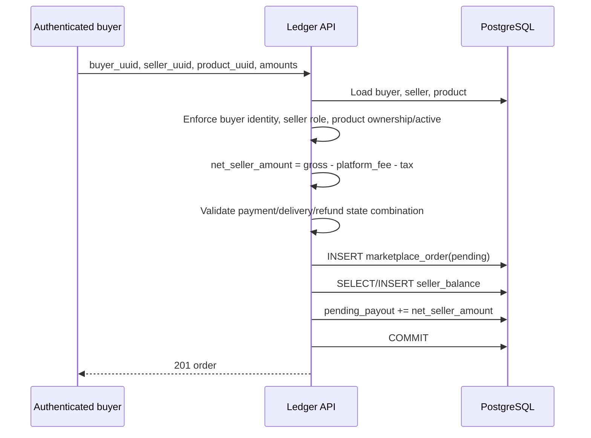

Order defaults are `payment_status=pending`, `delivery_status=pending`, and `refund_status=none`. Valid payment states are `pending`, `paid`, `refunded`, and `failed`; delivery states are `pending`, `ready`, and `revoked`; refund states are `none`, `requested`, `approved`, and `processed`.

`MarketplaceOrder` is the financial aggregate root. It links buyer, seller, product, gross amount, fee, tax, net seller amount, provider identifiers, and lifecycle statuses.

### 6.2 Ledger reads

- Admin reads all orders.
- Sellers read orders filtered by `seller_id`.
- Customers read orders filtered by `buyer_id`.
- Purchase history additionally loads `ProductAccess`, `RefundRecord`, and product assets for each buyer order.

The indexed columns (`uuid`, buyer, seller, product, payment status) support these access patterns.

## 7. Payment flows

Razorpay is the current and only implemented payment provider. Amounts are stored in major currency units in PostgreSQL and converted to the provider’s smallest unit (for INR, paise) at the gateway boundary.

### 7.1 Create provider payment order

Endpoint: `POST /v1/payments/orders/`

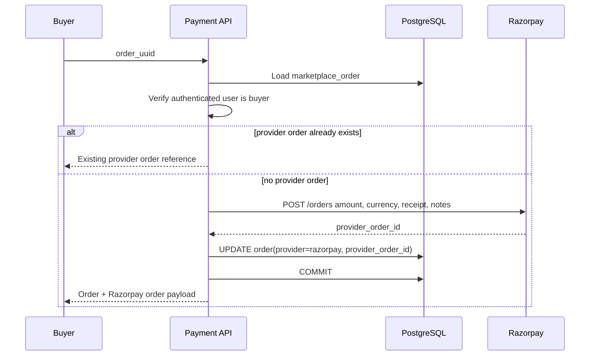

The provider receipt and notes include internal order, buyer, seller, and product UUIDs for reconciliation. The gateway selects test/live credentials from `PAYMENT_MODE`.

### 7.2 Browser checkout confirmation

Endpoint: `POST /v1/payments/confirm/`

```mermaid
sequenceDiagram
    participant B as Buyer
    participant API as Payment API
    participant DB as PostgreSQL
    participant RP as Razorpay signing logic

    B->>API: provider_order_id, payment_id, checkout_signature
    API->>DB: Find order by unique provider_order_id
    API->>API: Verify buyer owns order
    API->>RP: HMAC-SHA256 verify order_id|payment_id
    alt valid signature
        API->>DB: Set paid, payment id, delivery ready
        API->>DB: Insert/grant product_access
        API->>DB: pending_payout -= net; available_for_payout += net
        API->>DB: COMMIT
        API-->>B: Paid order
    else invalid
        API-->>B: 400 signature mismatch
    end
```

The paid transition is idempotent for the same provider payment ID: an already-paid order is not granted twice and the balance movement is not repeated.

### 7.3 Provider webhook reconciliation

Endpoint: `POST /v1/payments/webhook/razorpay/`

The webhook endpoint is intentionally not behind bearer authentication. Razorpay authenticates it with `X-Razorpay-Signature` over the raw request body.

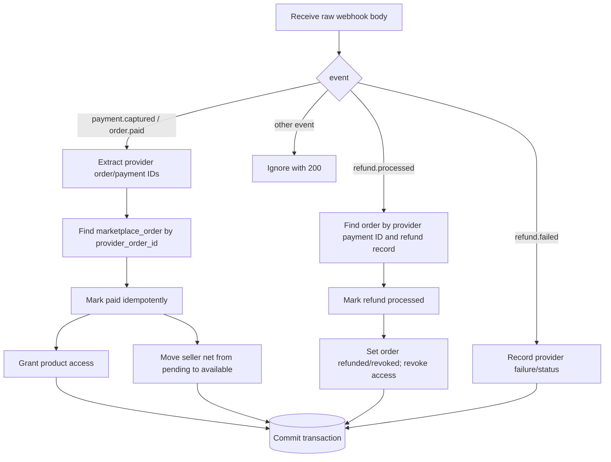

Supported payment events are `payment.captured` and `order.paid`. Supported refund events are `refund.processed` and `refund.failed`. Payment events update the same order state as checkout confirmation, allowing either path to reconcile the order. The webhook handler verifies the raw-body HMAC when a signature is supplied and returns an ignored response for unsupported events.

## 8. Refund flow

Endpoint: `POST /v1/ledger/orders/{order_uuid}/` with refund payload.

```mermaid
sequenceDiagram
    participant B as Buyer/Admin
    participant API as Ledger API
    participant DB as PostgreSQL
    participant RP as Razorpay

    B->>API: refund amount and reason
    API->>DB: Load order by UUID
    API->>API: Check buyer/admin permission and refund eligibility
    API->>DB: Reject duplicate refund; validate amount <= gross
    API->>DB: Create refund_record
    alt processed request for Razorpay-paid order
        API->>RP: POST /payments/{payment_id}/refund
        alt provider call succeeds
            RP-->>API: provider_refund_id/status
            API->>DB: Store provider refund identifiers
        else provider call fails
            API->>DB: Mark refund approved + failure_reason
            API->>DB: COMMIT
            API-->>B: Refund requires retry/reconciliation
        end
    end
    alt refund status is processed
        API->>DB: order payment=refunded, delivery=revoked
        API->>DB: refund_status=processed
        API->>DB: Revoke product access
        API->>DB: Decrease pending first, then available seller balance
    else requested/approved
        API->>DB: Update order refund_status only
    end
    API->>DB: COMMIT
    API-->>B: Refund record
```

The balance adjustment applies the refund amount against `SellerBalance.pending_payout` first. Any remainder is deducted from `available_for_payout`, floored at zero. A later provider webhook is the authoritative asynchronous confirmation when Razorpay processes or fails the refund.

Current limitation: the refund model allows one `RefundRecord` per order and does not maintain a separate immutable refund-event history or cumulative partial-refund total. This should be addressed before supporting multiple partial refunds or audit-grade accounting.

## 9. Seller balance and payout flows

### 9.1 Balance lifecycle

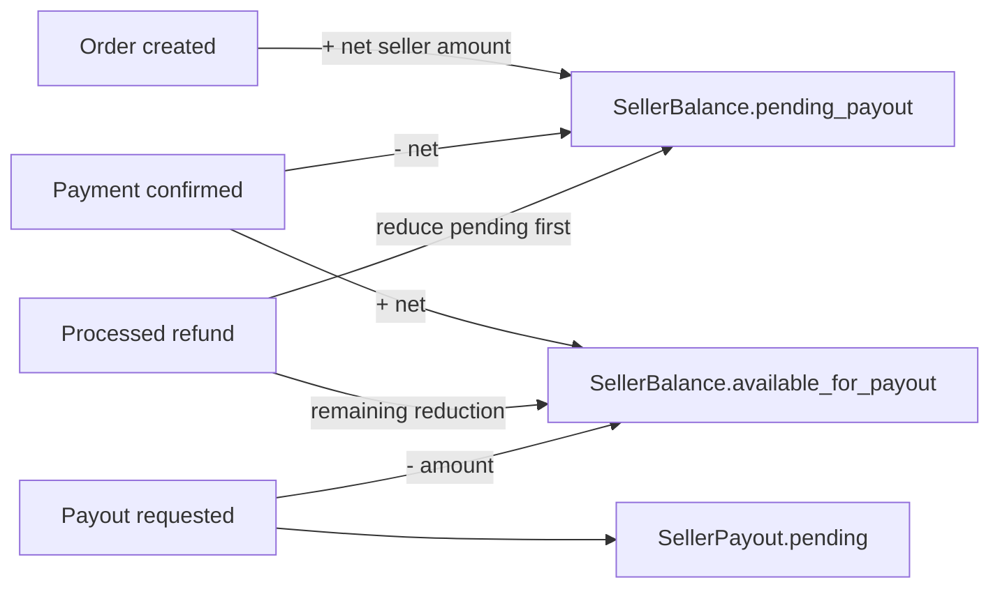

The balance is a cached operational projection derived from order and payout actions. There is no transaction-level ledger table or balance-history table in the current schema.

### 9.2 Payout request

Endpoints: `POST /v1/payouts/`, `GET /v1/payouts/`, `GET /v1/payouts/summary/`.

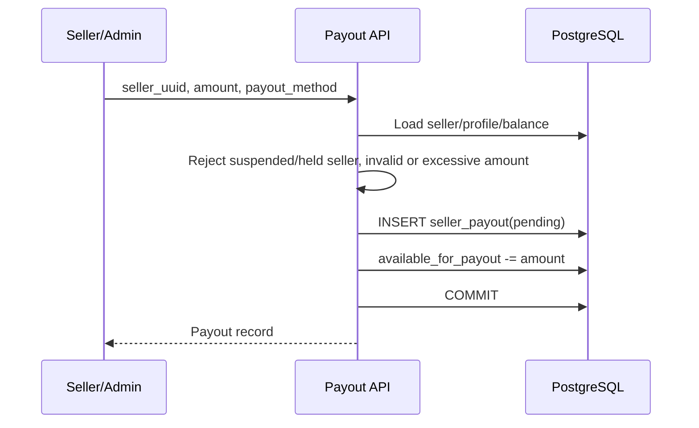

Payout methods are currently represented as metadata; there is no external bank/payout provider call in this codebase. Payout states are `pending`, `processing`, `paid`, `failed`, and `cancelled` with controlled transitions.

### 9.3 Admin batch, retry, and reconciliation

- `POST /v1/payouts/batch/`: loads each payout, assigns/validates `batch_id`, transitions it through `processing`, then to `paid` or `failed`, and commits the batch.
- `POST /v1/payouts/{uuid}/retry/`: only failed payouts can move back to `processing`.
- `GET /v1/payouts/reconciliation-summary/`: reads failed, open (`pending`/`processing`), and paid payouts and returns counts plus records.

Batch processing is a database status update, not a call to a payment rail. A future provider integration should add provider IDs, idempotency keys, callback/webhook reconciliation, and an outbox/job boundary.

## 10. Invoice flow

Endpoint: `GET /v1/ledger/orders/{order_uuid}/invoice/`.

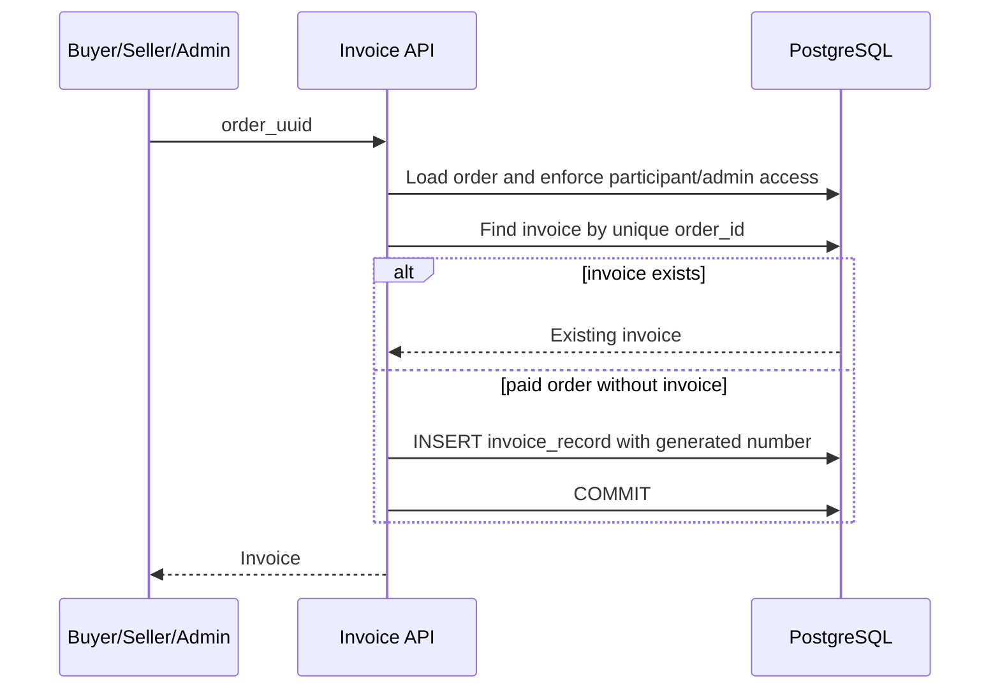

Invoices are available only after payment is confirmed. `invoice_record.order_id` is unique, so repeated reads return the same invoice.

## 11. Support, operations, and dashboard reads

These are authenticated module flows over the same database:

- support tickets/messages are created by customers/sellers and managed by admins;
- operations endpoints are admin-only and provide operational summaries;
- dashboard endpoints are seller/admin scoped and aggregate order, balance, and payout data;
- user listing is admin-only;
- seller moderation is admin-only.

They do not introduce a separate persistence store or event bus. Their controllers use the same role decorator and serializer/database-session pattern.

## 12. Database architecture and interaction rules

### 12.1 Relational model

```mermaid
erDiagram
    USER ||--o{ PRODUCT : owns
    USER ||--o{ MARKETPLACE_ORDER : buys
    USER ||--o{ MARKETPLACE_ORDER : sells
    PRODUCT ||--o{ MARKETPLACE_ORDER : purchased_as
    MARKETPLACE_ORDER ||--o{ REFUND_RECORD : has
    MARKETPLACE_ORDER ||--o| INVOICE_RECORD : has
    MARKETPLACE_ORDER ||--o{ PRODUCT_ACCESS : grants
    USER ||--o| SELLER_BALANCE : owns
    USER ||--o{ SELLER_PAYOUT : requests
    PRODUCT ||--o{ PRODUCT_ASSET : contains
    PRODUCT_ASSET ||--o{ PRODUCT_ASSET_DOWNLOAD : logs
    USER ||--o| SELLER_APPLICATION : submits
    USER ||--o| SELLER_PROFILE : has

    USER { int id PK; string uuid UK; string user_type; string is_active }
    PRODUCT { int id PK; string uuid UK; int owner_id FK; decimal price; string currency }
    MARKETPLACE_ORDER { int id PK; string uuid UK; int buyer_id FK; int seller_id FK; decimal net_seller_amount; string payment_status }
    SELLER_BALANCE { int id PK; int seller_id FK_UK; decimal available_for_payout; decimal pending_payout }
    SELLER_PAYOUT { int id PK; string uuid UK; int seller_id FK; decimal amount; string status }
    REFUND_RECORD { int id PK; string uuid UK; int order_id FK; decimal amount; string status }
    INVOICE_RECORD { int id PK; string uuid UK; int order_id FK_UK; string invoice_number UK }
    PRODUCT_ACCESS { int id PK; string uuid UK; int order_id FK; string access_status; int download_count }
    PRODUCT_ASSET { int id PK; string uuid UK; int product_id FK; string object_key UK; string asset_status }
    PRODUCT_ASSET_DOWNLOAD { int id PK; string uuid UK; int asset_id FK; string order_uuid }
    SELLER_APPLICATION { int id PK; string uuid UK; int user_id FK_UK; string status }
    SELLER_PROFILE { int id PK; string uuid UK; int user_id FK_UK; boolean payout_hold }
```

### 12.2 Session and transaction behavior

- SQLAlchemy/Flask-SQLAlchemy is initialized with `POSTGRES_DB_URI`.
- The application runs `db.create_all()` at startup as a bootstrap convenience; migrations are also present under `apps/api/migrations/` and should be the deployment mechanism for controlled schema changes.
- `get_primary_engine()` creates a cached SQLAlchemy engine. The custom session factory binds a scoped session to that engine.
- Write serializers use `@session_rollback(db)` and explicitly call `db.session.commit()` after the logical operation.
- Provider calls and database writes are not one distributed transaction. The implementation mitigates this with provider IDs, idempotent paid handling, and webhook reconciliation, but a provider timeout can still leave an intermediate local state.
- Numeric money fields use `Decimal`/`Numeric(10,2)`; conversion to provider minor units happens only at the gateway boundary.
- Unique constraints protect public UUIDs and provider IDs (`provider_order_id`, `provider_payment_id`, `provider_refund_id`), while indexes support participant/status lookups.

### 12.3 Read/write patterns by flow

| Flow | Reads | Writes | Commit boundary |
|---|---|---|---|
| Login | `user` by username/email | none | none |
| Order create | buyer, seller, product, seller balance | order, balance pending | order + balance |
| Payment order | order | provider IDs on order | provider ID update |
| Payment confirm/webhook | order by provider ID | order, access, balance | paid aggregate |
| Refund | order, existing refund, balance | refund, order, access, balance | refund aggregate or provider-failure record |
| Payout request | seller, profile, balance | payout, balance available | payout + balance |
| Asset upload | product | asset metadata/status | each status phase |
| Asset download | asset, order, access, token-use | token use, access count, download event | download audit operation |
| Invoice | order, invoice | invoice if absent | invoice insert |

### 12.4 Consistency and concurrency considerations

The current code does not use explicit row locks or database-level balance versioning. Concurrent payment/refund/payout requests can therefore race when updating a `SellerBalance`. Production hardening should:

1. use `SELECT ... FOR UPDATE` (or equivalent SQLAlchemy row locking) for balance and order transitions;
2. add idempotency keys for order creation, refunds, and payout requests;
3. add a unique constraint for one active refund per order only if that business rule remains valid;
4. introduce immutable financial entries and derive/reconcile balances from them;
5. add an outbox or durable job table for provider calls and webhook processing;
6. require and reject missing payment webhook signatures rather than accepting unsigned payment events;
7. move schema creation fully to Alembic migrations in deployment environments.

## 13. State and failure rules

### 13.1 Payment/order state invariants

| Condition | Required result |
|---|---|
| Paid order | `delivery_status=ready` |
| Refunded order | `delivery_status=revoked` |
| Processed refund | `payment_status=refunded` |
| Successful payment | access granted and seller balance moved pending → available |
| Processed refund | access revoked and seller balance reduced |
| Duplicate paid event | no duplicate access or balance movement |

### 13.2 Error mapping

- `401`: missing/invalid/expired bearer token, inactive user, invalid delivery token.
- `403`: valid identity but wrong role or resource ownership.
- `400`: schema, state, amount, provider, or business validation failure.
- `404`: requested order, asset, payout, application, or refund does not exist.
- `503`: health check cannot execute `SELECT 1` against PostgreSQL.

Controllers log the exception and return a JSON error. Sensitive credentials are supplied through configuration; provider secrets and private signing keys must not be committed.

## 14. API surface summary

| Area | Representative endpoints |
|---|---|
| Auth | `POST /v1/users/`, `POST /v1/users/login/`, `GET /v1/users/` |
| Seller onboarding | `/v1/seller-applications/`, `/submit/`, `/withdraw/`, admin review routes |
| Products/assets | product routes; `/v1/assets/upload-target/`, `/{asset}/complete/`, `/{asset}/deliver/`, `/{asset}/downloads/` |
| Ledger/orders | `/v1/ledger/orders/`, `/v1/ledger/orders/{uuid}/`, purchase history, invoice |
| Payments | `/v1/payments/orders/`, `/v1/payments/confirm/`, `/v1/payments/webhook/razorpay/` |
| Refunds | `POST /v1/ledger/orders/{uuid}/` |
| Payouts | `/v1/payouts/`, summary, batch, retry, reconciliation summary |
| Support/ops | support routes, admin operations routes, dashboard routes |

## 15. Deployment and observability notes

The API exposes `/health`, which checks PostgreSQL with `SELECT 1` and reports `ok/degraded`. Application logging is configured from `LOG_LEVEL` in the configuration layer. External provider calls should be monitored with request IDs, provider IDs, latency, response status, and retry metrics; the current implementation primarily logs controller exceptions and does not yet expose a structured audit/event stream.

## 16. Architecture decisions and known gaps

Implemented decisions:

- modular monolith for simple deployment and shared transaction boundaries;
- PostgreSQL as the source of truth for identity, catalog, order, money state, and access state;
- EdDSA JWTs for stateless API authentication;
- provider HMAC verification for checkout/webhooks;
- direct-to-object-storage uploads and short-lived signed delivery URLs;
- relational state machines for order, refund, payout, asset, and seller lifecycle.

Known gaps to resolve before high-volume or audit-sensitive production use:

- add row-level locking/optimistic concurrency for balances and order transitions;
- make webhook signature mandatory for all provider events and persist webhook delivery IDs/events;
- add idempotency keys and durable retry processing for provider operations;
- replace the mutable balance projection with an append-only double-entry ledger or immutable financial journal;
- support multiple refund records and cumulative partial-refund validation if required;
- implement a real payout provider integration and callback reconciliation;
- add rate limiting, stricter CORS origins, secret rotation, structured audit logs, and metrics;
- use Alembic migrations consistently instead of relying on `db.create_all()` in deployed environments.
